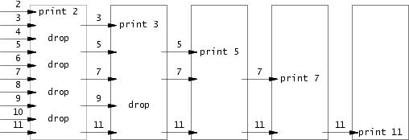

+++
title="MIT 6.S081 Lab 1: Xv6 and Unix utilities"
date=2024-02-07
description="MIT 6.S081 课程 lab1 记录"
[taxonomies]
tags = ["MIT6.S081","OS","操作系统"]
[extra]
toc = true
+++

最近在学习 MIT 6.S081 课程，看完了 lecture 1,挑战一下实验并在这里记录一下

## 环境搭建

主要是 riscv gcc 编译工具链和 qemu 的一系列工具。具体参见 [Lab tools].

**Arch linux**

```shell
paru -S riscv64-linux-gnu-binutils riscv64-linux-gnu-gcc riscv64-linux-gnu-gdb qemu-arch-extra

```

实验以及 xv6 kernel 的代码需要用 git clone 到本地

```shell
git clone git://g.csail.mit.edu/xv6-labs-2021
git checkout util # 切换到util分支，也就是第一个实验的分支
make qemu #build and run xv6

```

我自己在编译的时候遇到了一点问题，gcc 提示 `-Werror=infinite-recursion`,删除 Makefile 中`CFLAGS`的`-Werror`选项后解决问题

> 怀疑是编译器版本问题，但无限递归是一个挺常见的 Warning 选项. 不知道其他人是怎么编译的:)

[lab tools]: https://pdos.csail.mit.edu/6.828/2021/tools.html

## Sleep

非常简单的一个程序，直接系统调用就行

```c
#include "kernel/types.h"
#include "user/user.h"

int main(int argc, char *argv[])
{
    const char *arg_msg = "missing sleep time!\n";
    if (argc < 2)
    {
        write(1, arg_msg, strlen(arg_msg)); //后来发现有printf可以直接用
    }
    int dur = atoi(argv[1]);

    exit(sleep(dur));
}
```

## PingPong

需要两个管道，每个管道一端读一端写，注意顺序：
父进程写，子进程读，子进程输出，子进程写，父进程读，父进程输出。

```c
#include "kernel/types.h"
#include "user/user.h"

int main()
{
    int p1[2];
    int p2[2];
    pipe(p1);
    pipe(p2);
    char buffer[1] = {'x'};
    int ret = fork();
    if (ret == 0)
    {
        int pid = getpid();
        close(p1[1]);
        close(p2[0]);
        read(p1[0], buffer, 1);
        printf("%d: received ping\n", pid);
        write(p2[1], buffer, 1);
        exit(0);
    }
    else
    {
        int pid = getpid();
        close(p1[0]);
        close(p2[1]);
        write(p1[1], buffer, 1);
        read(p2[0], buffer, 1);
        printf("%d: received pong\n", pid);

        exit(0);
    }
}
```

## Primes

这个有点复杂，首先先了解一下多进程求素数的原理


每个进程有一个读管道（readp）读取上个进程（左邻居）传送过来的数字，一个写管道（writep）将数字发送给下一个进程（右邻居）。 具体参见[Bell Labs and CSP Threads]

当前进程读取管道，第一个数（cur）即为素数，一直从管道读取并将不是该数(cur)倍数的数字写进管道，传给下一个进程

[Bell Labs and CSP Threads]: https://swtch.com/~rsc/thread/

实现的思路是，最新的进程 fork()的返回值永远是 0,只要处理好初始进程，后续进程的逻辑直接按照上文实现，当没有数可读时，直接退出。

```c
#include "kernel/types.h"
#include "user/user.h"

int main()
{
    int p0[2] = {0};
    pipe(p0);
    for (int i = 2; i <= 35; i++)
    {
        write(p0[1], &i, sizeof(int));
    }
    close(p0[1]);
    int readp = p0[0];
    while (1)
    {
        int ret = fork();//除初始进程外，每个进程都会fork()两次，第一次由父进程fork()出来
                        // 此时子进程p 的ret值为0,执行素数判断程序（读，写）
                        // 之后p再次fork后ret值不再为0,直接等待（wait）p的子进程结束，
                        // 然后跳出循环，p退出
        if (ret == 0)
        {
            int cur = 2;
            int np[2] = {0};
            int flag = 0;
            pipe(np);
            int writep = np[1];
            int n = read(readp, &cur, sizeof(int));
            if (n == 0)
            {
                exit(0);
            }
            printf("prime %d\n", cur);
            int num = 0;
            while (read(readp, &num, sizeof(int)))
            {
                if (num % cur != 0)
                {
                    write(writep, &num, sizeof(int));
                }
                flag++;
            }
            close(writep);
            close(readp);
            readp = np[0];
        }
        else
        {
            int cp;
            wait(&cp);
            exit(0);
        }
    }
}

```

## find

参考 `user/ls.c` 中的代码递归查找，不要递归 `.` 和 `..` 目录

另外观察代码可知，xv6 的目录和应该就是一个文件，想获取目录名直接读取该文件的 16 个字节就可以获取这个目录的信息 `struct dirent`

```c
#include "kernel/types.h"
#include "user/user.h"
#include "kernel/fs.h"
#include "kernel/stat.h"

int find(char *patt, char *path)
{
    char buf[512], *p;
    int fd;
    struct dirent de;
    struct stat st;

    if ((fd = open(path, 0)) < 0)
    {
        fprintf(2, "find: cannot open %s\n", path);
        return;
    }

    if (fstat(fd, &st) < 0)
    {
        fprintf(2, "find: cannot stat %s\n", path);
        close(fd);
        return;
    }
    switch (st.type)
    {
    case T_FILE:
        p = path + strlen(path);
        for (; p >= path && *p != '/'; p--)
            ;
        p++;
        int ret = strcmp(p, patt);
        if (!ret)
        {
            printf("%s\n", path);
        }
        break;
    case T_DIR:
        if (strlen(path) + 1 + DIRSIZ + 1 > sizeof buf)
        {
            printf("find: path too long\n");
            break;
        }
        strcpy(buf, path);
        p = buf + strlen(buf);
        *p++ = '/';
        while (read(fd, &de, sizeof(de)) == sizeof(de))
        {
            if (de.inum == 0)
                continue;
            if (!(strcmp(".", de.name)) || (!strcmp("..", de.name)))
            {
                continue;
            }
            memmove(p, de.name, DIRSIZ);
            p[DIRSIZ] = 0;
            if (stat(buf, &st) < 0)
            {
                printf("find: cannot stat %s\n", buf);
                continue;
            }
            find(patt, buf);
        }
        break;
    }
    close(fd);
}
int main(int argc, char *argv[])
{
    if (argc < 3)
    {
        printf("Missing parament!");
    }
    find(argv[2], argv[1]);
    exit(0);
}
```

## xargs

待续
